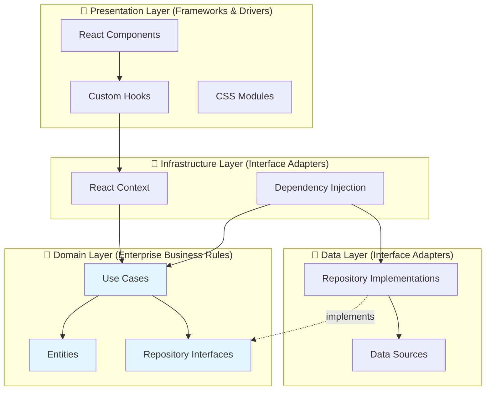

# Clean Architecture Deep Dive

This document provides an in-depth explanation of how Clean Architecture principles are applied in this Todo application.

## Table of Contents
1. [Clean Architecture Principles](#clean-architecture-principles)
2. [Layer-by-Layer Breakdown](#layer-by-layer-breakdown)
3. [Dependency Flow](#dependency-flow)
4. [Design Patterns Used](#design-patterns-used)
5. [Testing Strategy](#testing-strategy)
6. [Benefits & Trade-offs](#benefits--trade-offs)

## Clean Architecture Principles

### The Dependency Rule

> **Source code dependencies must point only inward, toward higher-level policies.**

This is the fundamental rule of Clean Architecture. It means:

- **Domain layer** has NO dependencies on outer layers
- **Data layer** depends on Domain (via interfaces)
- **Presentation layer** depends on Domain (via use cases)
- **Infrastructure layer** wires everything together

### The Layers



## Layer-by-Layer Breakdown

### 1. Domain Layer (Core Business Logic)

**Location**: `src/domain/`

**Purpose**: Contains the business logic that is independent of any framework, UI, or database.

#### Entities (`src/domain/entities/`)

Pure data structures representing business concepts:

```typescript
// src/domain/entities/Todo.ts
export interface Todo {
    id: string;              // Unique identifier
    text: string;            // Task description
    completed: boolean;      // Completion status
    createdAt: number;       // Creation timestamp
    priority: 'low' | 'medium' | 'high';  // Priority level
    category?: string;       // Optional category
    dueDate?: number;        // Optional due date
}
```

**Characteristics**:
- ✅ No dependencies on frameworks
- ✅ No dependencies on UI
- ✅ No dependencies on databases
- ✅ Pure TypeScript interfaces/classes
- ✅ Can be used in any context (web, mobile, server)

#### Repository Interfaces (`src/domain/repositories/`)

Abstract contracts defining data operations:

```typescript
// src/domain/repositories/TodoRepository.ts
import type { Todo } from '../entities/Todo';

export interface TodoRepository {
    getTodos(): Promise<Todo[]>;
    saveTodo(todo: Todo): Promise<void>;
    updateTodo(todo: Todo): Promise<void>;
    deleteTodo(id: string): Promise<void>;
}
```

**Why interfaces?**
- Defines WHAT operations are needed, not HOW they're implemented
- Allows multiple implementations (localStorage, API, IndexedDB, etc.)
- Enables easy testing with mock implementations
- Follows Dependency Inversion Principle

#### Use Cases (`src/domain/usecases/`)

Single-responsibility business operations:

```typescript
// src/domain/usecases/AddTodo.ts
import type { TodoRepository } from '../repositories/TodoRepository';
import type { Todo } from '../entities/Todo';

export class AddTodo {
    constructor(private repository: TodoRepository) {}
    
    async execute(todo: Todo): Promise<void> {
        // Business logic could go here
        // e.g., validation, business rules, etc.
        await this.repository.saveTodo(todo);
    }
}
```

**Use Case Pattern Benefits**:
- ✅ Single Responsibility: Each use case does ONE thing
- ✅ Testable: Easy to unit test with mocked repository
- ✅ Reusable: Can be called from any UI (web, mobile, CLI)
- ✅ Clear Intent: Name describes exactly what it does

**All Use Cases**:
- `AddTodo` - Creates a new todo
- `GetTodos` - Retrieves all todos
- `UpdateTodo` - Modifies an existing todo
- `DeleteTodo` - Removes a todo

### 2. Data Layer (Infrastructure)

**Location**: `src/data/`

**Purpose**: Implements the repository interfaces with concrete data sources.

#### Repository Implementation

```typescript
// src/data/repositories/LocalStorageTodoRepository.ts
import type { TodoRepository } from '../../domain/repositories/TodoRepository';
import type { Todo } from '../../domain/entities/Todo';

export class LocalStorageTodoRepository implements TodoRepository {
    private storageKey = 'clean_arch_todos';
    
    async getTodos(): Promise<Todo[]> {
        const data = localStorage.getItem(this.storageKey);
        return data ? JSON.parse(data) : [];
    }
    
    async saveTodo(todo: Todo): Promise<void> {
        const todos = await this.getTodos();
        todos.push(todo);
        localStorage.setItem(this.storageKey, JSON.stringify(todos));
    }
    
    async updateTodo(todo: Todo): Promise<void> {
        const todos = await this.getTodos();
        const index = todos.findIndex(t => t.id === todo.id);
        if (index !== -1) {
            todos[index] = todo;
            localStorage.setItem(this.storageKey, JSON.stringify(todos));
        }
    }
    
    async deleteTodo(id: string): Promise<void> {
        const todos = await this.getTodos();
        const filtered = todos.filter(t => t.id !== id);
        localStorage.setItem(this.storageKey, JSON.stringify(todos));
    }
}
```

**Key Points**:
- ✅ Implements domain interface
- ✅ Handles localStorage specifics
- ✅ Can be swapped with API implementation
- ✅ Tested with integration tests

**Alternative Implementations** (not in this project, but possible):

```typescript
// Could easily add:
export class ApiTodoRepository implements TodoRepository {
    async getTodos(): Promise<Todo[]> {
        const response = await fetch('/api/todos');
        return response.json();
    }
    // ... other methods
}

export class IndexedDBTodoRepository implements TodoRepository {
    // IndexedDB implementation
}
```

### 3. Infrastructure Layer (Dependency Injection)

**Location**: `src/infrastructure/di/`

**Purpose**: Wires dependencies together and provides them to the application.

```typescript
// src/infrastructure/di/TodoContext.tsx
import React, { createContext, useContext, useState, useEffect } from 'react';
import { LocalStorageTodoRepository } from '../../data/repositories/LocalStorageTodoRepository';
import { GetTodos } from '../../domain/usecases/GetTodos';
import { AddTodo } from '../../domain/usecases/AddTodo';
import { UpdateTodo } from '../../domain/usecases/UpdateTodo';
import { DeleteTodo } from '../../domain/usecases/DeleteTodo';
import type { Todo } from '../../domain/entities/Todo';

interface TodoContextType {
    todos: Todo[];
    loading: boolean;
    getTodos: () => Promise<void>;
    add: (text: string, priority: 'low' | 'medium' | 'high', category?: string, dueDate?: number) => Promise<void>;
    update: (id: string, text: string, priority: 'low' | 'medium' | 'high', category?: string, dueDate?: number) => Promise<void>;
    toggle: (id: string) => Promise<void>;
    remove: (id: string) => Promise<void>;
}

const TodoContext = createContext<TodoContextType | null>(null);

export const TodoProvider: React.FC<{ children: ReactNode }> = ({ children }) => {
    const [todos, setTodos] = useState<Todo[]>([]);
    const [loading, setLoading] = useState(true);
    
    // 1. Create repository instance
    const repository = new LocalStorageTodoRepository();
    
    // 2. Create use case instances with injected repository
    const getTodosUseCase = new GetTodos(repository);
    const addTodoUseCase = new AddTodo(repository);
    const updateTodoUseCase = new UpdateTodo(repository);
    const deleteTodoUseCase = new DeleteTodo(repository);
    
    // 3. Provide methods that call use cases
    const getTodos = async () => {
        setLoading(true);
        try {
            const fetchedTodos = await getTodosUseCase.execute();
            setTodos(fetchedTodos);
        } catch (error) {
            console.error('Failed to fetch todos:', error);
        } finally {
            setLoading(false);
        }
    };
    
    // ... other methods
    
    return (
        <TodoContext.Provider value={{ todos, loading, getTodos, add, update, toggle, remove }}>
            {children}
        </TodoContext.Provider>
    );
};
```

**Dependency Injection Benefits**:
- ✅ Centralized dependency management
- ✅ Easy to swap implementations (change `LocalStorageTodoRepository` to `ApiTodoRepository`)
- ✅ Testable (can provide mock context in tests)
- ✅ Single place to configure the app

### 4. Presentation Layer (UI)

**Location**: `src/presentation/`

**Purpose**: React components and hooks that interact with use cases.

#### Custom Hooks (ViewModels)

```typescript
// src/presentation/hooks/useTodos.ts
import { useTodoContext } from '../../infrastructure/di/TodoContext';

export const useTodos = () => {
    const { todos, loading, getTodos, add, update, toggle, remove } = useTodoContext();
    
    return {
        todos,
        loading,
        getTodos,
        add,
        update,
        toggle,
        remove
    };
};
```

**Hook Pattern Benefits**:
- ✅ Encapsulates state management logic
- ✅ Reusable across components
- ✅ Testable in isolation
- ✅ Follows React best practices

#### Components

```typescript
// src/presentation/components/TodoList.tsx
import { TodoItem } from './TodoItem';
import type { Todo } from '../../domain/entities/Todo';

interface Props {
    todos: Todo[];
    onToggle: (id: string) => void;
    onDelete: (id: string) => void;
    onUpdate: (id: string, text: string, priority: 'low' | 'medium' | 'high', category?: string, dueDate?: number) => void;
}

export const TodoList: React.FC<Props> = ({ todos, onToggle, onDelete, onUpdate }) => {
    if (todos.length === 0) {
        return <div className={styles.empty}>No tasks yet. Add one to get started!</div>;
    }
    
    return (
        <div className={styles.list}>
            {todos.map(todo => (
                <TodoItem
                    key={todo.id}
                    todo={todo}
                    onToggle={onToggle}
                    onDelete={onDelete}
                    onUpdate={onUpdate}
                />
            ))}
        </div>
    );
};
```

**Component Characteristics**:
- ✅ Presentational (focused on UI)
- ✅ Receives data via props
- ✅ Calls callbacks for actions
- ✅ No direct use case calls
- ✅ Easily testable

## Dependency Flow

### Data Flow (Read Operation)

```
User opens app
    ↓
App.tsx renders
    ↓
useTodos() hook called
    ↓
TodoContext provides getTodos()
    ↓
GetTodos use case executed
    ↓
TodoRepository.getTodos() called
    ↓
LocalStorageTodoRepository reads from localStorage
    ↓
Data flows back up through layers
    ↓
Component re-renders with data
```

### Command Flow (Write Operation)

```
User clicks "Add Task"
    ↓
Component calls onAdd callback
    ↓
useTodos.add() called
    ↓
TodoContext.add() executed
    ↓
AddTodo use case executed
    ↓
TodoRepository.saveTodo() called
    ↓
LocalStorageTodoRepository writes to localStorage
    ↓
getTodos() called to refresh data
    ↓
Component re-renders with updated data
```

## Design Patterns Used

### 1. **Repository Pattern**
- Abstracts data access
- Provides collection-like interface
- Hides implementation details

### 2. **Use Case Pattern (Interactor)**
- Encapsulates business logic
- Single responsibility
- Framework-independent

### 3. **Dependency Injection**
- Inverts control
- Enables loose coupling
- Facilitates testing

### 4. **Context Provider Pattern**
- React-specific DI mechanism
- Provides dependencies to component tree
- Avoids prop drilling

### 5. **Custom Hook Pattern**
- Encapsulates stateful logic
- Reusable across components
- Testable

## Testing Strategy

### Test Pyramid

```
         /\
        /  \     Behavioral Tests (E2E)
       /    \    - Full user workflows
      /------\   - 7 tests
     /        \  
    /  Component Tests
   /    - UI behavior
  /     - 24 tests
 /----------------\
/   Integration Tests
    - Repository implementations
    - 6 tests
--------------------
    Unit Tests
    - Use cases
    - Entities
    - 10 tests
```

### 1. Unit Tests (Domain Layer)

**What**: Test use cases in isolation

**How**: Mock repository interfaces

```typescript
// src/domain/usecases/__tests__/AddTodo.test.ts
import { describe, it, expect, vi } from 'vitest';
import { AddTodo } from '../AddTodo';
import type { TodoRepository } from '../../repositories/TodoRepository';

describe('AddTodo Use Case', () => {
    it('should add a todo via repository', async () => {
        // Arrange
        const mockRepository: TodoRepository = {
            getTodos: vi.fn(),
            saveTodo: vi.fn(),
            updateTodo: vi.fn(),
            deleteTodo: vi.fn(),
        };
        const addTodo = new AddTodo(mockRepository);
        const todo = {
            id: '1',
            text: 'Test',
            completed: false,
            createdAt: Date.now(),
            priority: 'medium' as const,
        };
        
        // Act
        await addTodo.execute(todo);
        
        // Assert
        expect(mockRepository.saveTodo).toHaveBeenCalledWith(todo);
    });
});
```

**Benefits**:
- ✅ Fast execution
- ✅ Tests business logic only
- ✅ No framework dependencies
- ✅ Easy to maintain

### 2. Integration Tests (Data Layer)

**What**: Test repository implementations with real data sources

**How**: Mock external dependencies (localStorage)

```typescript
// src/data/repositories/__tests__/LocalStorageTodoRepository.test.ts
import { describe, it, expect, beforeEach, vi } from 'vitest';
import { LocalStorageTodoRepository } from '../LocalStorageTodoRepository';

describe('LocalStorageTodoRepository', () => {
    let repository: LocalStorageTodoRepository;
    
    beforeEach(() => {
        localStorage.clear();
        vi.clearAllMocks();
        repository = new LocalStorageTodoRepository();
    });
    
    it('should save and retrieve todos', async () => {
        const todo = {
            id: '1',
            text: 'Test',
            completed: false,
            createdAt: 1000,
            priority: 'medium' as const,
        };
        
        await repository.saveTodo(todo);
        const todos = await repository.getTodos();
        
        expect(todos).toContainEqual(todo);
    });
});
```

### 3. Component Tests (Presentation Layer)

**What**: Test UI components and user interactions

**How**: Render components and simulate user events

```typescript
// src/presentation/components/__tests__/TodoItem.test.tsx
import { describe, it, expect, vi } from 'vitest';
import { render, screen } from '@testing-library/react';
import userEvent from '@testing-library/user-event';
import { TodoItem } from '../TodoItem';

describe('TodoItem', () => {
    it('should call onToggle when checkbox is clicked', async () => {
        const mockToggle = vi.fn();
        const todo = {
            id: '1',
            text: 'Test',
            completed: false,
            createdAt: 1000,
            priority: 'medium' as const,
        };
        
        render(<TodoItem todo={todo} onToggle={mockToggle} onDelete={vi.fn()} onUpdate={vi.fn()} />);
        
        const user = userEvent.setup();
        await user.click(screen.getByLabelText('Toggle todo'));
        
        expect(mockToggle).toHaveBeenCalledWith('1');
    });
});
```

### 4. Behavioral Tests (E2E)

**What**: Test complete user workflows

**How**: Render full app and simulate real user behavior

```typescript
// src/presentation/__tests__/AppBehavior.test.tsx
import { describe, it, expect } from 'vitest';
import { render, screen, waitFor } from '@testing-library/react';
import userEvent from '@testing-library/user-event';
import App from '../../App';

describe('App Behavior (BDD)', () => {
    it('should allow a user to add, complete, and delete a task', async () => {
        const user = userEvent.setup();
        render(<App />);
        
        // Add task
        await user.click(screen.getByLabelText('Add Task'));
        await user.type(screen.getByPlaceholderText('What needs to be done?'), 'Buy Groceries');
        await user.click(screen.getByText('Create Task'));
        
        // Verify task appears
        await waitFor(() => {
            expect(screen.getByText('Buy Groceries')).toBeInTheDocument();
        });
        
        // Complete task
        await user.click(screen.getByLabelText('Toggle todo'));
        
        // Delete task
        await user.click(screen.getByLabelText('Delete'));
        
        // Verify task is gone
        await waitFor(() => {
            expect(screen.queryByText('Buy Groceries')).not.toBeInTheDocument();
        });
    });
});
```

## Benefits & Trade-offs

### Benefits ✅

1. **Testability**
   - Business logic can be tested without UI
   - Easy to mock dependencies
   - Fast unit tests

2. **Maintainability**
   - Clear separation of concerns
   - Easy to locate code
   - Changes are localized

3. **Flexibility**
   - Swap implementations easily
   - Add new features without breaking existing code
   - Support multiple UIs (web, mobile, desktop)

4. **Independence**
   - Business logic independent of frameworks
   - Can migrate from React to Vue/Angular
   - Can switch from localStorage to API

5. **Team Collaboration**
   - Clear boundaries between layers
   - Multiple developers can work on different layers
   - Easier code reviews

### Trade-offs ⚖️

1. **Initial Complexity**
   - More files and folders
   - Steeper learning curve
   - More boilerplate code

2. **Over-engineering for Small Apps**
   - Might be overkill for simple CRUD apps
   - More abstraction than necessary

3. **Performance Overhead**
   - Additional function calls through layers
   - (Usually negligible in practice)

### When to Use Clean Architecture

**✅ Good fit for:**
- Medium to large applications
- Apps with complex business logic
- Long-term projects
- Team projects
- Apps that need to support multiple platforms

**❌ Might be overkill for:**
- Simple prototypes
- Throwaway code
- Very small apps
- Solo weekend projects

## Conclusion

This Todo app demonstrates that Clean Architecture is not just for backend systems—it can be successfully applied to frontend applications as well. The key is understanding the principles and adapting them to the specific needs of your project.

The architecture provides:
- **Clear boundaries** between business logic and infrastructure
- **Testable code** at every layer
- **Flexibility** to change implementations
- **Maintainability** for long-term projects

While it adds some initial complexity, the benefits become clear as the application grows and evolves.
