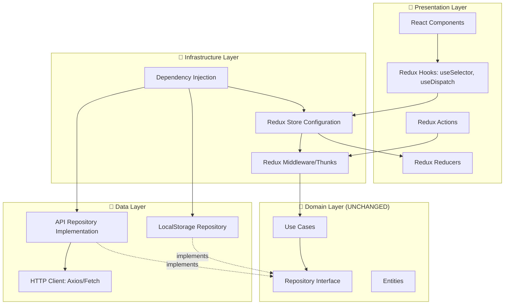

# Redux + Backend API Integration Plan

## Overview

This document outlines how to integrate **Redux** for state management and a **Backend API** for data persistence while maintaining Clean Architecture principles.

## Key Principle: The Dependency Rule Still Applies

> **The Domain layer remains independent of Redux and API implementations**

## Architecture with Redux + API



## 1. Redux Integration

### Why Redux with Clean Architecture?

Redux becomes a **presentation layer concern** for:
- Managing UI state (loading, errors, selected filters)
- Caching data from use cases
- Optimistic updates
- Undo/redo functionality

### Implementation Strategy

#### Option A: Redux as State Container (Recommended)

Redux stores the **results** of use case executions, not business logic.

```typescript
// src/presentation/store/slices/todoSlice.ts
import { createSlice, createAsyncThunk } from '@reduxjs/toolkit';
import type { Todo } from '../../../domain/entities/Todo';

// Async thunks call use cases
export const fetchTodos = createAsyncThunk(
    'todos/fetchTodos',
    async (_, { extra }) => {
        // 'extra' contains injected use cases
        const getTodosUseCase = extra.getTodos;
        return await getTodosUseCase.execute();
    }
);

export const addTodo = createAsyncThunk(
    'todos/addTodo',
    async (todo: Todo, { extra }) => {
        const addTodoUseCase = extra.addTodo;
        await addTodoUseCase.execute(todo);
        return todo;
    }
);

const todoSlice = createSlice({
    name: 'todos',
    initialState: {
        items: [] as Todo[],
        loading: false,
        error: null as string | null,
    },
    reducers: {
        // Optimistic updates
        todoToggled: (state, action) => {
            const todo = state.items.find(t => t.id === action.payload);
            if (todo) {
                todo.completed = !todo.completed;
            }
        },
    },
    extraReducers: (builder) => {
        builder
            .addCase(fetchTodos.pending, (state) => {
                state.loading = true;
            })
            .addCase(fetchTodos.fulfilled, (state, action) => {
                state.loading = false;
                state.items = action.payload;
            })
            .addCase(fetchTodos.rejected, (state, action) => {
                state.loading = false;
                state.error = action.error.message || 'Failed to fetch todos';
            });
    },
});

export const { todoToggled } = todoSlice.actions;
export default todoSlice.reducer;
```

#### Store Configuration with Dependency Injection

```typescript
// src/infrastructure/store/configureStore.ts
import { configureStore } from '@reduxjs/toolkit';
import todoReducer from '../../presentation/store/slices/todoSlice';
import { LocalStorageTodoRepository } from '../../data/repositories/LocalStorageTodoRepository';
import { ApiTodoRepository } from '../../data/repositories/ApiTodoRepository';
import { GetTodos } from '../../domain/usecases/GetTodos';
import { AddTodo } from '../../domain/usecases/AddTodo';
import { UpdateTodo } from '../../domain/usecases/UpdateTodo';
import { DeleteTodo } from '../../domain/usecases/DeleteTodo';

export const createAppStore = (useApi: boolean = false) => {
    // Choose repository implementation
    const repository = useApi 
        ? new ApiTodoRepository('https://api.example.com')
        : new LocalStorageTodoRepository();
    
    // Create use cases with injected repository
    const useCases = {
        getTodos: new GetTodos(repository),
        addTodo: new AddTodo(repository),
        updateTodo: new UpdateTodo(repository),
        deleteTodo: new DeleteTodo(repository),
    };
    
    return configureStore({
        reducer: {
            todos: todoReducer,
        },
        middleware: (getDefaultMiddleware) =>
            getDefaultMiddleware({
                thunk: {
                    extraArgument: useCases, // Inject use cases
                },
            }),
    });
};

export type RootState = ReturnType<ReturnType<typeof createAppStore>['getState']>;
export type AppDispatch = ReturnType<typeof createAppStore>['dispatch'];
```

#### Using Redux in Components

```typescript
// src/presentation/components/TodoList.tsx
import { useEffect } from 'react';
import { useAppDispatch, useAppSelector } from '../hooks/reduxHooks';
import { fetchTodos, addTodo, todoToggled } from '../store/slices/todoSlice';
import { TodoItem } from './TodoItem';

export const TodoList = () => {
    const dispatch = useAppDispatch();
    const { items, loading, error } = useAppSelector(state => state.todos);
    
    useEffect(() => {
        dispatch(fetchTodos());
    }, [dispatch]);
    
    const handleAddTodo = async (text: string) => {
        const todo = {
            id: crypto.randomUUID(),
            text,
            completed: false,
            createdAt: Date.now(),
            priority: 'medium' as const,
        };
        
        // Optimistic update
        dispatch(todoToggled(todo.id));
        
        // Call use case via thunk
        await dispatch(addTodo(todo));
    };
    
    if (loading) return <div>Loading...</div>;
    if (error) return <div>Error: {error}</div>;
    
    return (
        <div>
            {items.map(todo => (
                <TodoItem key={todo.id} todo={todo} />
            ))}
        </div>
    );
};
```

### Redux Benefits in Clean Architecture

✅ **Centralized state management**
✅ **Time-travel debugging**
✅ **Optimistic updates**
✅ **Undo/redo functionality**
✅ **DevTools integration**
✅ **Still calls use cases for business logic**

## 2. Backend API Integration

### API Repository Implementation

The beauty of Clean Architecture: **Just implement the interface!**

```typescript
// src/data/repositories/ApiTodoRepository.ts
import type { TodoRepository } from '../../domain/repositories/TodoRepository';
import type { Todo } from '../../domain/entities/Todo';
import axios, { AxiosInstance } from 'axios';

export class ApiTodoRepository implements TodoRepository {
    private client: AxiosInstance;
    
    constructor(baseURL: string) {
        this.client = axios.create({
            baseURL,
            headers: {
                'Content-Type': 'application/json',
            },
        });
        
        // Add interceptors for auth, error handling, etc.
        this.client.interceptors.request.use((config) => {
            const token = localStorage.getItem('auth_token');
            if (token) {
                config.headers.Authorization = `Bearer ${token}`;
            }
            return config;
        });
    }
    
    async getTodos(): Promise<Todo[]> {
        const response = await this.client.get<Todo[]>('/todos');
        return response.data;
    }
    
    async saveTodo(todo: Todo): Promise<void> {
        await this.client.post('/todos', todo);
    }
    
    async updateTodo(todo: Todo): Promise<void> {
        await this.client.put(`/todos/${todo.id}`, todo);
    }
    
    async deleteTodo(id: string): Promise<void> {
        await this.client.delete(`/todos/${id}`);
    }
}
```

### Hybrid Repository (Offline-First)

Combine localStorage and API for offline-first functionality:

```typescript
// src/data/repositories/HybridTodoRepository.ts
import type { TodoRepository } from '../../domain/repositories/TodoRepository';
import type { Todo } from '../../domain/entities/Todo';
import { LocalStorageTodoRepository } from './LocalStorageTodoRepository';
import { ApiTodoRepository } from './ApiTodoRepository';

export class HybridTodoRepository implements TodoRepository {
    private localRepo: LocalStorageTodoRepository;
    private apiRepo: ApiTodoRepository;
    private syncQueue: Array<{ action: string; data: any }> = [];
    
    constructor(apiBaseUrl: string) {
        this.localRepo = new LocalStorageTodoRepository();
        this.apiRepo = new ApiTodoRepository(apiBaseUrl);
        
        // Sync when online
        window.addEventListener('online', () => this.syncWithServer());
    }
    
    async getTodos(): Promise<Todo[]> {
        try {
            // Try API first
            const todos = await this.apiRepo.getTodos();
            // Cache locally
            await this.localRepo.clear();
            for (const todo of todos) {
                await this.localRepo.saveTodo(todo);
            }
            return todos;
        } catch (error) {
            // Fallback to local
            console.warn('API unavailable, using local cache');
            return await this.localRepo.getTodos();
        }
    }
    
    async saveTodo(todo: Todo): Promise<void> {
        // Save locally immediately
        await this.localRepo.saveTodo(todo);
        
        try {
            // Try to sync with API
            await this.apiRepo.saveTodo(todo);
        } catch (error) {
            // Queue for later sync
            this.syncQueue.push({ action: 'save', data: todo });
            console.warn('Queued for sync:', todo);
        }
    }
    
    async updateTodo(todo: Todo): Promise<void> {
        await this.localRepo.updateTodo(todo);
        
        try {
            await this.apiRepo.updateTodo(todo);
        } catch (error) {
            this.syncQueue.push({ action: 'update', data: todo });
        }
    }
    
    async deleteTodo(id: string): Promise<void> {
        await this.localRepo.deleteTodo(id);
        
        try {
            await this.apiRepo.deleteTodo(id);
        } catch (error) {
            this.syncQueue.push({ action: 'delete', data: id });
        }
    }
    
    private async syncWithServer(): Promise<void> {
        console.log('Syncing with server...');
        
        for (const item of this.syncQueue) {
            try {
                switch (item.action) {
                    case 'save':
                        await this.apiRepo.saveTodo(item.data);
                        break;
                    case 'update':
                        await this.apiRepo.updateTodo(item.data);
                        break;
                    case 'delete':
                        await this.apiRepo.deleteTodo(item.data);
                        break;
                }
            } catch (error) {
                console.error('Sync failed for:', item);
            }
        }
        
        this.syncQueue = [];
        console.log('Sync complete');
    }
}
```

### Configuration-Based Repository Selection

```typescript
// src/infrastructure/config/repositoryConfig.ts
import { TodoRepository } from '../../domain/repositories/TodoRepository';
import { LocalStorageTodoRepository } from '../../data/repositories/LocalStorageTodoRepository';
import { ApiTodoRepository } from '../../data/repositories/ApiTodoRepository';
import { HybridTodoRepository } from '../../data/repositories/HybridTodoRepository';

export type RepositoryType = 'local' | 'api' | 'hybrid';

export const createTodoRepository = (
    type: RepositoryType = 'local',
    apiUrl?: string
): TodoRepository => {
    switch (type) {
        case 'api':
            if (!apiUrl) throw new Error('API URL required for API repository');
            return new ApiTodoRepository(apiUrl);
            
        case 'hybrid':
            if (!apiUrl) throw new Error('API URL required for hybrid repository');
            return new HybridTodoRepository(apiUrl);
            
        case 'local':
        default:
            return new LocalStorageTodoRepository();
    }
};
```

### Environment-Based Configuration

```typescript
// src/infrastructure/config/environment.ts
export const config = {
    repositoryType: (import.meta.env.VITE_REPO_TYPE || 'local') as RepositoryType,
    apiUrl: import.meta.env.VITE_API_URL || 'http://localhost:3000/api',
    enableRedux: import.meta.env.VITE_ENABLE_REDUX === 'true',
};
```

```typescript
// .env.development
VITE_REPO_TYPE=hybrid
VITE_API_URL=http://localhost:3000/api
VITE_ENABLE_REDUX=true
```

```typescript
// .env.production
VITE_REPO_TYPE=api
VITE_API_URL=https://api.production.com
VITE_ENABLE_REDUX=true
```

## 3. Complete Integration Example

### Updated Store Configuration

```typescript
// src/infrastructure/store/configureStore.ts
import { configureStore } from '@reduxjs/toolkit';
import todoReducer from '../../presentation/store/slices/todoSlice';
import { createTodoRepository } from '../config/repositoryConfig';
import { config } from '../config/environment';
import { GetTodos } from '../../domain/usecases/GetTodos';
import { AddTodo } from '../../domain/usecases/AddTodo';
import { UpdateTodo } from '../../domain/usecases/UpdateTodo';
import { DeleteTodo } from '../../domain/usecases/DeleteTodo';

export const createAppStore = () => {
    // Create repository based on environment
    const repository = createTodoRepository(config.repositoryType, config.apiUrl);
    
    // Create use cases with injected repository
    const useCases = {
        getTodos: new GetTodos(repository),
        addTodo: new AddTodo(repository),
        updateTodo: new UpdateTodo(repository),
        deleteTodo: new DeleteTodo(repository),
    };
    
    return configureStore({
        reducer: {
            todos: todoReducer,
        },
        middleware: (getDefaultMiddleware) =>
            getDefaultMiddleware({
                thunk: {
                    extraArgument: useCases,
                },
            }),
    });
};
```

### Updated App Entry Point

```typescript
// src/main.tsx
import React from 'react';
import ReactDOM from 'react-dom/client';
import { Provider } from 'react-redux';
import App from './App';
import { createAppStore } from './infrastructure/store/configureStore';
import { config } from './infrastructure/config/environment';
import './index.css';

const store = createAppStore();

ReactDOM.createRoot(document.getElementById('root')!).render(
    <React.StrictMode>
        <Provider store={store}>
            <App />
        </Provider>
    </React.StrictMode>
);

console.log('App started with:', {
    repositoryType: config.repositoryType,
    apiUrl: config.apiUrl,
    reduxEnabled: config.enableRedux,
});
```

## 4. Testing Strategy with Redux + API

### Testing Redux Slices

```typescript
// src/presentation/store/slices/__tests__/todoSlice.test.ts
import { configureStore } from '@reduxjs/toolkit';
import todoReducer, { fetchTodos } from '../todoSlice';
import { vi } from 'vitest';

describe('Todo Slice', () => {
    it('should handle fetchTodos.fulfilled', () => {
        const todos = [{ id: '1', text: 'Test', completed: false }];
        const action = fetchTodos.fulfilled(todos, '');
        const state = todoReducer(undefined, action);
        
        expect(state.items).toEqual(todos);
        expect(state.loading).toBe(false);
    });
});
```

### Testing API Repository

```typescript
// src/data/repositories/__tests__/ApiTodoRepository.test.ts
import { describe, it, expect, vi, beforeEach } from 'vitest';
import { ApiTodoRepository } from '../ApiTodoRepository';
import axios from 'axios';

vi.mock('axios');

describe('ApiTodoRepository', () => {
    let repository: ApiTodoRepository;
    
    beforeEach(() => {
        repository = new ApiTodoRepository('http://test.com');
    });
    
    it('should fetch todos from API', async () => {
        const mockTodos = [{ id: '1', text: 'Test', completed: false }];
        vi.mocked(axios.create).mockReturnValue({
            get: vi.fn().mockResolvedValue({ data: mockTodos }),
        } as any);
        
        const todos = await repository.getTodos();
        
        expect(todos).toEqual(mockTodos);
    });
});
```

## 5. Benefits of This Architecture

### ✅ Flexibility
- Switch between localStorage, API, or hybrid **without changing business logic**
- Toggle Redux on/off via configuration
- Easy to add new repository implementations

### ✅ Testability
- Mock repositories for use case tests
- Mock use cases for Redux tests
- Integration tests for API repository

### ✅ Maintainability
- Clear separation of concerns
- Changes to API don't affect business logic
- Redux is just a presentation detail

### ✅ Scalability
- Add caching layer
- Add GraphQL repository
- Add WebSocket repository
- All implement the same interface!

## 6. Migration Path

### Phase 1: Add API Repository
1. Create `ApiTodoRepository.ts`
2. Update DI configuration
3. Test with API

### Phase 2: Add Redux (Optional)
1. Install Redux Toolkit
2. Create slices
3. Configure store with use cases
4. Update components to use Redux

### Phase 3: Add Hybrid Mode
1. Create `HybridTodoRepository.ts`
2. Implement sync logic
3. Handle offline scenarios

## Conclusion

**The key insight**: Redux and API are **implementation details** in the outer layers. The domain layer (use cases, entities, repository interfaces) **remains completely unchanged**.

This is the power of Clean Architecture:
- Business logic is **independent** of state management
- Business logic is **independent** of data sources
- You can **swap implementations** without breaking anything

The architecture **scales** from a simple localStorage app to a complex offline-first, Redux-powered, API-backed application—all while keeping the core business logic pristine and testable.
